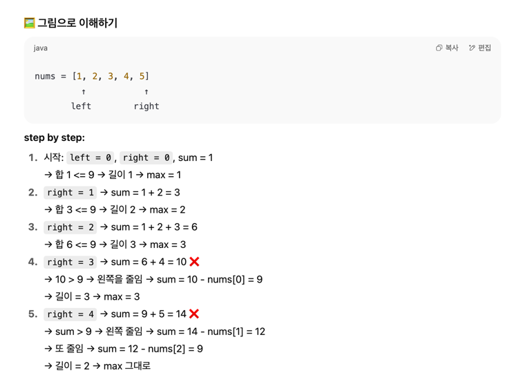

## 🪟 슬라이딩 윈도우 쉽게 설명

슬라이딩 윈도우는 이렇게 생각하면 돼요:

- 배열에서 "창문"을 하나 만든다고 생각해요.
- 이 창문을 왼쪽부터 오른쪽으로 "슬라이딩"하면서 합을 계산해요.
- 합이 `k`보다 작거나 같으면 **창문을 넓히고**
- 합이 `k`보다 크면 **창문을 왼쪽에서 줄여요**.

---

## 🖼️ 그림으로 이해하기
🖼️ 그림으로 이해하기
